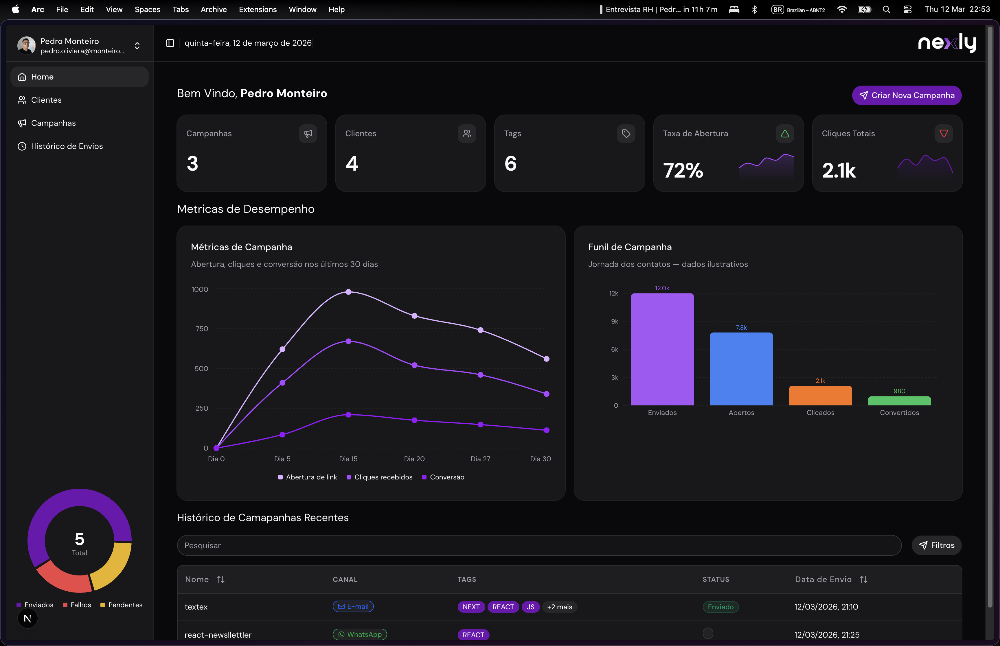
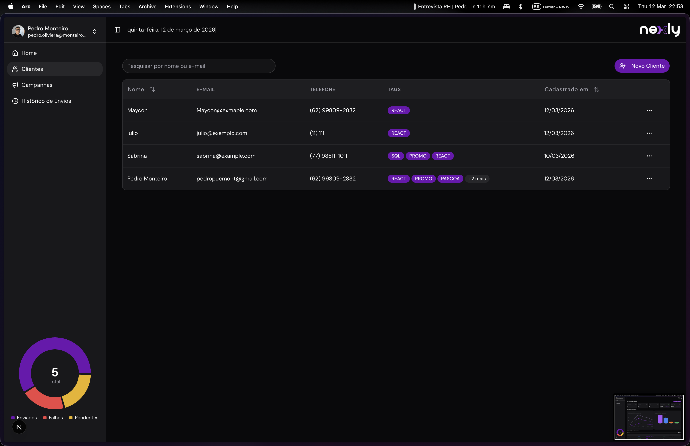
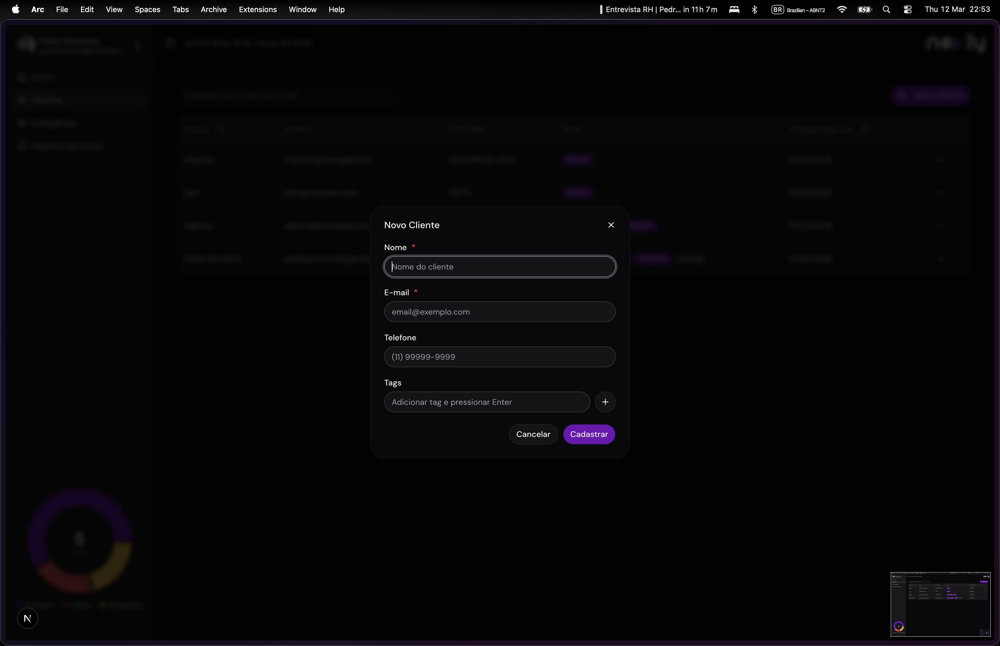
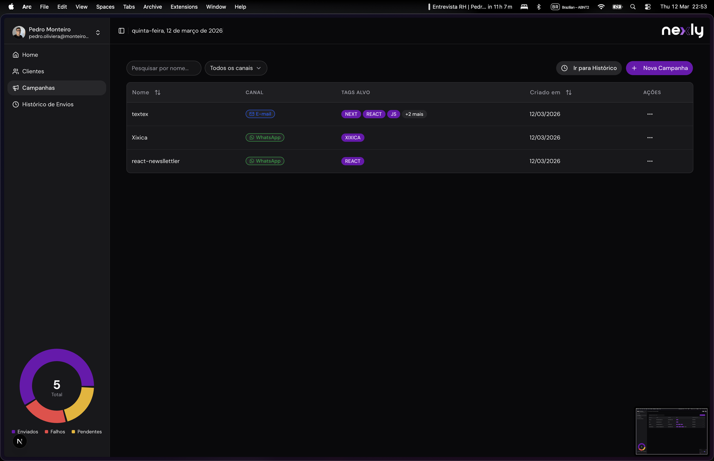
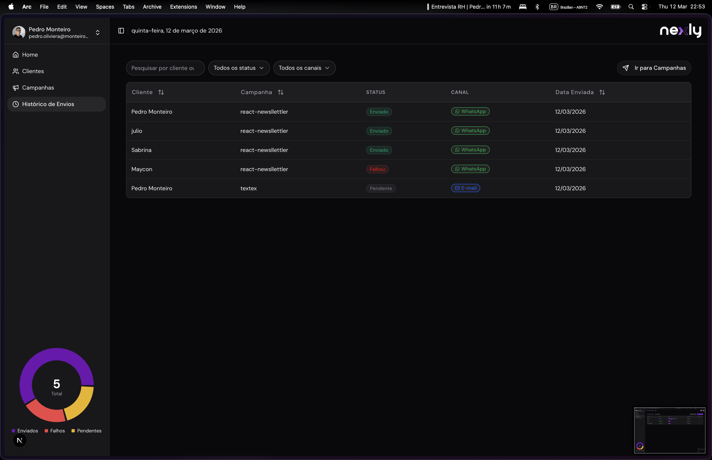

# Nexly Project 

Plataforma de gerenciamento de campanhas de comunicação com clientes via Email e WhatsApp.

## Tech Stack


> Next.js · React · Fastify · Node.js · TypeScript · PostgreSQL · Docker · Prisma · shadcn/ui

---

## Table of Contents

- [Overview](#overview)
- [Features](#features)
- [Architecture](#architecture)
- [Getting Started](#getting-started)
- [Contact](#contact)

---

## Overview

Nexly é uma plataforma web de gerenciamento de campanhas de comunicação que permite:

- Cadastrar e gerenciar clientes com tags de segmentação
- Criar campanhas de comunicação por Email ou WhatsApp
- Enviar campanhas segmentadas por tags
- Visualizar o histórico completo de envios com status em tempo real

---

## Features

- **Clientes** — Cadastro e listagem com campos: nome, email, telefone e tags
- **Campanhas** — Criação com nome, mensagem, canal (email | whatsapp) e tags-alvo
- **Envio de Campanha** — Seleção automática de clientes pelas tags e geração de registros de envio
- **Histórico de Envios** — Visualização por cliente, campanha, status (pending | sent | failed) e data

---

## Architecture

```
nexly-project/
├── app/
│   ├── api/        # Back-end: Fastify + Prisma + PostgreSQL (porta 3333)
│   └── web/        # Front-end: Next.js + shadcn/ui (porta 3000)
├── infra/          # Dockerfiles (api e web)
├── docker-compose.yaml
└── .env.example
```

| Layer    | Technology                    |
|----------|-------------------------------|
| Frontend | React + Next.js               |
| Backend  | Fastify + Prisma              |
| Database | PostgreSQL                    |
| Infra    | Docker / Docker Compose       |

---

## Screenshots

### Dashboard


### Clients List


### Create Client


### Campaigns


### History


---

## Getting Started

### Pré-requisitos

- [Docker](https://www.docker.com/) e Docker Compose
- [Node.js](https://nodejs.org/) 18+
- [npm](https://www.npmjs.com/)

### Back-end (API + Banco de Dados)

```bash
cd app/api
cp .env.example .env
docker compose up -d
```

> O Docker irá subir a API Fastify e o banco PostgreSQL. A API ficará disponível em `http://localhost:3333`.

### Front-end

```bash
cd app/web
cp .env.example .env
npm run build
npm run start
```

> O frontend ficará disponível em `http://localhost:3000`.

---

## 📬 Contact

[](https://www.linkedin.com/in/opedro-monteiro/)
[](mailto:pedro.oliveira@monteirodev.com)
